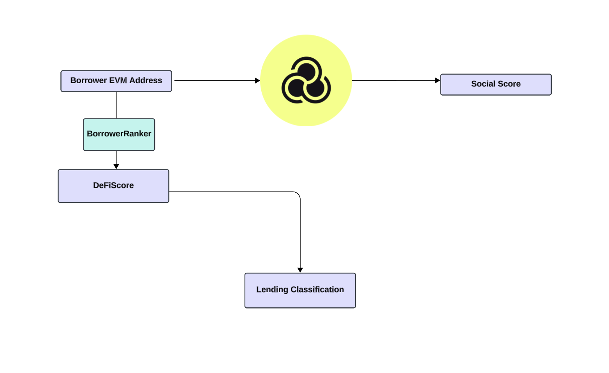

# BorrowerRanker

## Description

**BorrowerRanker** is an advanced extension developed to augment peer-to-peer (P2P) lending protocols within the decentralized finance (DeFi) ecosystem. By integrating a dynamic scoring system for borrower profiles, it leverages the robustness of blockchain technology for transparent and dependable reputation management. The system categorizes borrowers based on their borrowing history into classifications such as small, medium, and large, determined by the platform's average loan sizes. **BorrowerRanker** employs the EigenTrust algorithm from Karma3Labs for a nuanced, trust-based scoring system, emerging as a pivotal tool for P2P lending protocols aiming to incorporate sophisticated borrower evaluation mechanisms.

## Architecture

The architecture above illustrates how **BorrowerRanker** interfaces with the Ethereum blockchain, layer 2 solutions like Optimism, and external APIs such as Karma3Labs to manage borrower profiles efficiently. Through smart contracts developed in Solidity, it handles the complexities of borrower classification, score updates based on lending activities, and seamless integration with existing DeFi lending platforms.

## Technology Used

- **EigenTrust (Karma3Labs)**: Leverages the algorithm to rank borrower profiles based on their borrowing history, thereby enhancing the trustworthiness and reliability of P2P lending decisions.
- **Blockchain Platform**: Ethereum
- **Layer 2 Solution**: Optimism, ensuring scalable and cost-effective transactions.
- **Smart Contract Development**: Solidity, utilized for crafting the logic behind borrower ranking and for integration with Karma3Labs' API.
- **Data Indexing and Querying**: The Graph, for efficient management and indexing of on-chain data relevant to borrower activities.
- **Identity Verification**: Implements Decentralized Identity (DID) solutions for secure verification of borrower identities.
- **Upgradeability**: Incorporates OpenZeppelin's upgradeable contracts framework, facilitating seamless future enhancements.

## Core Smart Contracts

1. **BorrowerClassification.sol**: This contract is the heart of **BorrowerRanker**, responsible for classifying borrowers into tiers and dynamically scoring them using the EigenTrust algorithm. Key functions include `classifyBorrower` and `getBorrowerScore`, which play a pivotal role in managing the borrower rankings.

2. **Integration with Karma3Labs**: Through the `BorrowerClassification` contract, **BorrowerRanker** interacts with Karma3Labs' API to fetch and incorporate social scores into the DeFi scoring system, ensuring a comprehensive evaluation of borrower profiles.

